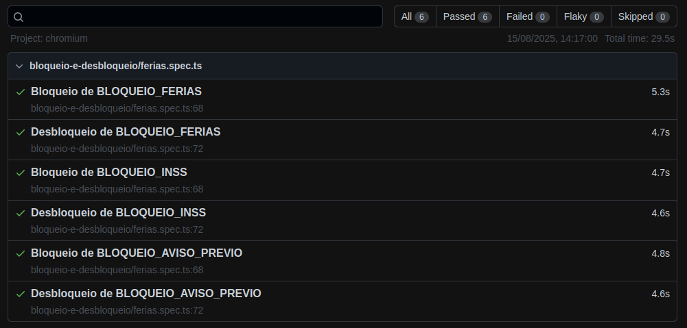
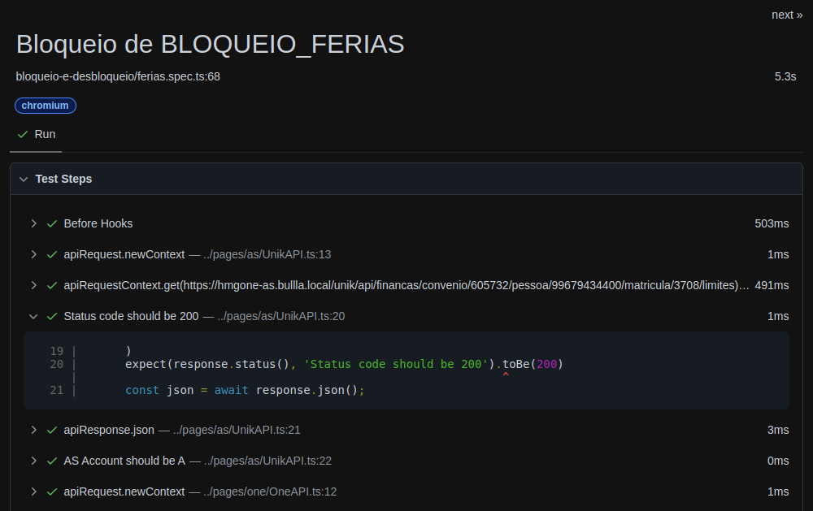
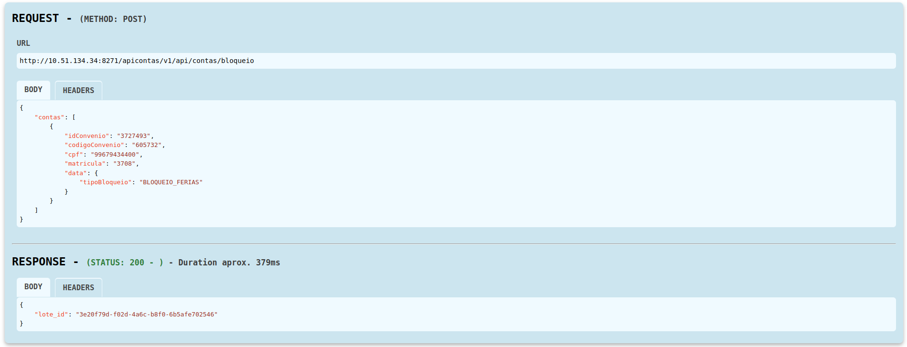

# HUB E2E TESTS

O objetivo deste projeto é validar fluxos de **bloqueio e desbloqueio de contas** no contexto do HUB, garantindo a consistência entre diferentes APIs (`UnikAPI`, `OneAPI`, `FunctionalSituation`).

## 🧰 Tecnologias e Bibliotecas Utilizadas

- [Node.js](https://nodejs.org/)
- [TypeScript](https://www.typescriptlang.org/)
- [Playwright](https://playwright.dev/) 
- [pw-api-pluggin](https://github.com/sclavijosuero/pw-api-plugin)

## 💻 Instalação
```bash
git clone <url-projeto>
cd ./caminho-projeto
npm i
```
## 📁 Estrutura do Projeto

```
.
├── fixtures/ # Fixtures customizadas (ex: autenticação, urls)
├── pages/ # Page Objects (interações com APIs/serviços)
│ ├── as/
│ ├── hub/
│ └── one/
├── playwight-report/ # Relatórios gerados automaticamente
├── test-data/ # Massa de dados em JSON
├── test-results/ # Resultados de execução
├── tests/ # Specs de teste (fluxos de negócio)
├── playwright.config.ts # Configuração principal do Playwright
└── tsconfig.json # Configuração do TypeScript
```
O projetro está estruturado no formato page objects onde /page armazena as interações (ts) com o portal/endpoint do AS, HUB e ONE. Dessa forma, ao desenvovler uma spec em /tests é possível reutizar as principais interações agrupadas em /page.

/test-data contem arquivos auxiliares com dados que podem ser utilizados durante o teste como dados para incorporar no body ou header da requisição


## ▶️ Como Executar os Testes

Rodar teste específico:
```bash
npx playwright test ./test-name
```
Rodar todos os testes:
```bash
npx playwright test
```
Rodar todos os testes com browser visível:
```bash
npx playwright test --headed
```

## 📊 Relatórios

Após rodar os testes, o Playwright gera um relatório interativo em playwright-report/index.html. Para exebir o report utilizar o comando abaixo:
```bash
npx playwright show-report
```
Visão de testes executados


Visão de passos executados no teste


Anexo da chamada da API
